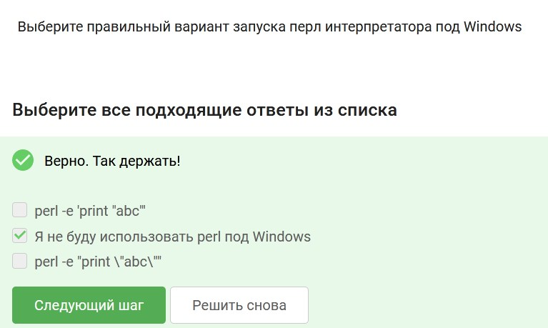

  
  
### Задачи из курса ["Введение в Perl"](https://stepik.org/course/3039)  
  
[01](src/intro/01_min_and_max.pl) Функция поиска минимального и максимального из 3-х чисел  
[02](src/intro/02_quadratic_equation.pl) Решение квадратного уравнения  
[03](src/intro/03_factorial.pl) Вычисление факториала  
[04](src/intro/04_prime_numbers.pl) Вычисление простых чисел в диапазоне  
  